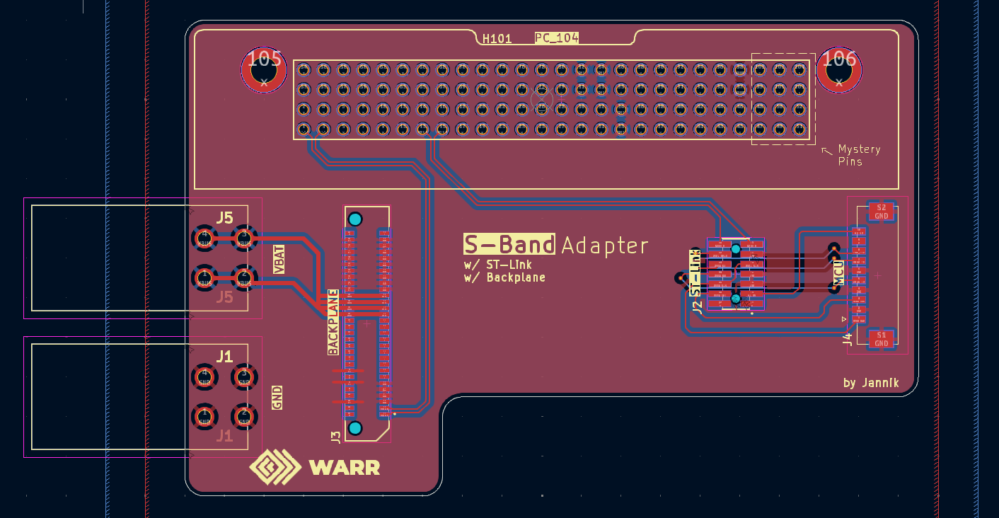
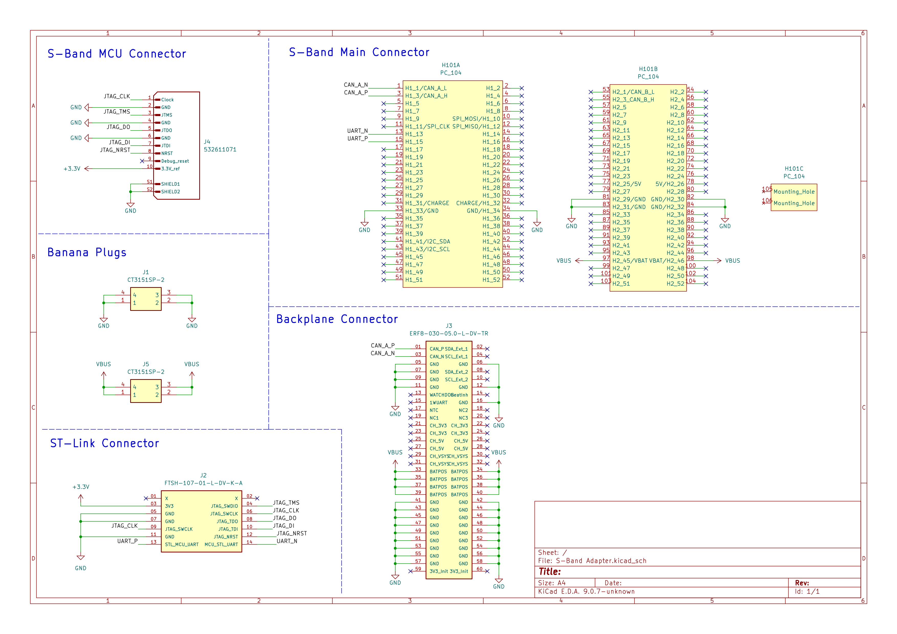

# S-Band Adapter

*(image might be outdated, check interactive viewer)*

**Notes:**

- Under 10x10 cm
- Designed to get stacked *on top* of the S-Band module
- Passes ERC & DRC

**Links:**

- [Interactive PCB View (powered by KiCanvas)](https://kicanvas.org/?repo=https%3A%2F%2Fgithub.com%2Fplaylogo%2FS-Band-Adapter%2Ftree%2Fmaster%2Fpcb%2FS-Band%2520Adapter)

## Connectors

- [`CT3151SP`](https://componentsearchengine.com/part-view/CT3151SP-2/Cal%20Test): Banana plugs for VBat & GND
- [`FTSH‑107‑01‑L‑DV‑K‑A`](https://www.snapeda.com/parts/FTSH-107-01-L-DV-K-A/Samtec%20Inc./view-part/?welcome=home&ref=digikey): ST-Link debug connector, uses UART A from PC104
- [`ERF8-030-05.0-L-DV-TR`](https://www.snapeda.com/parts/ERF8-030-05.0-L-DV-TR/Samtec%20Inc./view-part/?ref=digikey): Move Backplane connector
- [`Molex 53261–1071`](https://www.snapeda.com/parts/532611071/Molex/view-part/?ref=digikey): S-Band MCU Debug Connector

## Schematic

