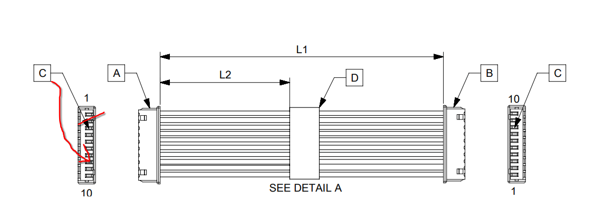

# S-Band Adapter

*(image might be outdated, check interactive viewer for latest version)*

**Notes:**

- Under 10x10 cm
- Designed to get stacked *on top* of the S-Band module
- Passes ERC & DRC

**Links:**

- [Interactive PCB View (powered by KiCanvas, always up to date)](https://kicanvas.org/?repo=https%3A%2F%2Fgithub.com%2Fplaylogo%2FS-Band-Adapter%2Ftree%2Fmaster%2Fpcb%2FS-Band%2520Adapter)

## Components

**SMD Parts:**

- 2x [`CT3151SP`](https://www.digikey.de/de/products/detail/cal-test-electronics/CT3151SP-2/6005547): Banana plugs for VBat & GND - *[footprint](https://componentsearchengine.com/part-view/CT3151SP-2/Cal%20Test)*
- 1x [`FTSH‑107‑01‑L‑DV‑K‑A`](https://www.digikey.de/de/products/detail/samtec-inc/FTSH-107-01-L-DV-K-A/7443623): ST-Link debug connector, uses UART A from PC104 - *[footprint](https://www.snapeda.com/parts/FTSH-107-01-L-DV-K-A/Samtec%20Inc./view-part/?welcome=home&ref=digikey)*
- 1x [`ERF8-030-05.0-L-DV-TR`](https://www.digikey.de/de/products/detail/samtec-inc/ERF8-030-05-0-L-DV-TR/6613294): Move Backplane connector - *[footprint](https://www.snapeda.com/parts/ERF8-030-05.0-L-DV-TR/Samtec%20Inc./view-part/?ref=digikey)*
- 1x [`Molex 53261–1071 10pin`](https://www.digikey.de/de/products/detail/molex/0532611071/699102): S-Band MCU Debug Connector - Same MCU Debug connector on S-Band module - *[footprint](https://www.snapeda.com/parts/532611071/Molex/view-part/?ref=digikey)*
- S-Band connector:
  - Either set of two proper 52 Pin 2.54 Pitch connectors like [these overpriced ones (ESQ-126-39-G-D)](https://www.digikey.de/de/products/detail/samtec-inc/ESQ-126-39-G-D/3601055)
  - Or just a bunch of female and male 2.54mm Pitch connectors cut and combined to get 4 rows x 26 Pins (female for S-Band board, male for this Adapter) - maybe bad idea, since you then cannot stack more than one board on top of the S-Band module...
- 1x 0805 100nF capacitor
- 1x Würth 430152050826 Tactile Switch

**Cables:**

- Adapter Backplane female to Backplane female: Possibly a [Samtec ERCD with 30pos ? - looks very expensive, who even selected the Backplane connector, maybe they know which cable to use...](https://www.samtec.com/products/ercd#)
- S-Band MCU Debug Connector: [Molex PicoBlade 1.25mm, Female-to-Female, 300.00mm Length, 10 Circuits](https://www.molex.com/en-us/products/part-detail/151341003) - Pin order on one side has to be reversed... See image below, `C` should come out on the 3rd from the bottom and not 3rd from top, can easily be done with a screwdrivers

## Schematic

